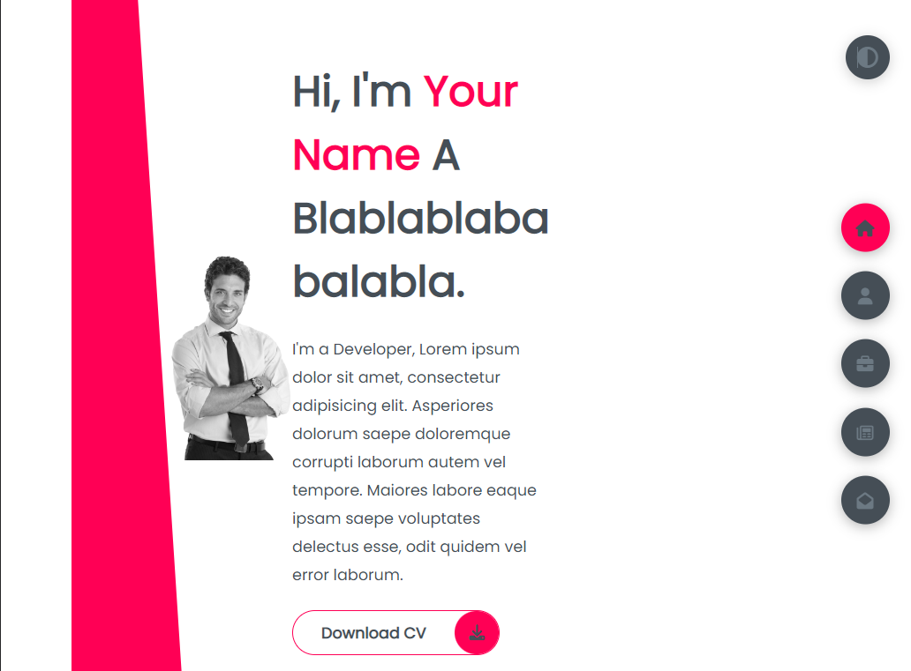

# A POrtfolio Template
Simple portfolio template to show your experience and skills.

  
  
  

## Getting Started
To get a local copy up and running follow these simple example steps.

## Built With
- HTML, CSS, JavaScript,

## Features

**📖 Static Layout**

**🎨 Styled with Boobstrap, SASS and Css with easy to customize colors**

**📱 Fully Responsive**

### Prerequisites
- A simple web browser (preferably Chrome or Firefox)
- A IDE to deploy it.

### Setup
- Download this repository and open index.html file.

## Authors
👤 **Leonel Carrizo**
