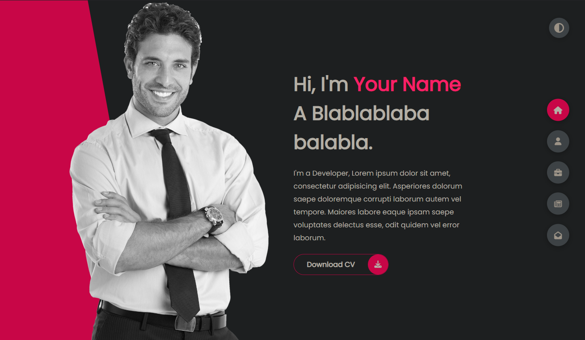
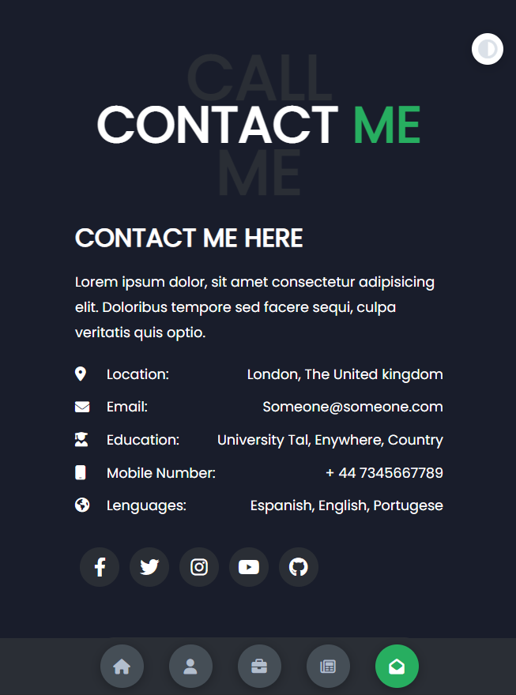

# Landing Page Coinbase Clone
Simple Coinbase landing page clone, to practicing my skills.

  
  
  

## Getting Started
To get a local copy up and running follow these simple example steps.

## Built With
- HTML, CSS, JavaScript, 

## Features

**📖 Multi-Page Layout**

**🎨 Styled with Boobstrap, SAAS and Css with easy to customize colors**

**📱 Fully Responsive**

### Prerequisites
- A simple web browser (preferably Chrome or Firefox)
- A IDE to deploy it. 

### Setup
- Download this repository and open index.html file.

## Authors
👤 **Leonel Carrizo**
